# SmartFlow Agent Hub - MVP 技术设计文档 (v1.0)

## 1. 总体架构 (System Architecture)

采用**前后端分离**架构，前端负责交互与展示，后端负责业务逻辑、Agent 编排及 MCP 工具调度。

### 1.1 技术栈 (Tech Stack)

*   **前端 (Frontend)**
    *   **框架**: Vue 3 (Composition API, ^3.4.0)
    *   **语言**: TypeScript (主要) / JavaScript (混合)
    *   **构建工具**: Vite 5
    *   **UI 组件库**: Arco Design Vue (`@arco-design/web-vue`)
    *   **状态管理**: Pinia (推荐)
    *   **HTTP 客户端**: Axios
    *   **Markdown 渲染**: markdown-it / highlight.js

*   **后端 (Backend)**
    *   **语言**: Python 3.12
    *   **Web 框架**: FastAPI (异步高性能)
    *   **Agent 框架**: LangChain (编排 Core Agent, RAG, Tools)
    *   **工具协议**: Model Context Protocol (MCP) Python SDK
    *   **数据库**: SQLite (MVP 阶段轻量化存储)
    *   **ORM**: SQLAlchemy / SQLModel (推荐)

### 1.2 架构图 (Architecture Diagram)

```mermaid
graph TD
    Client[前端 Vue3 + Arco Design] <-->|REST API / WebSocket| Server[后端 FastAPI]
    
    subgraph "Backend Services"
        Server --> Auth[认证模块]
        Server --> KB[知识库服务 RAG]
        Server --> Agent[Agent 引擎 LangChain]
        
        Agent --> Memory[会话记忆]
        Agent --> Planner[意图识别 & 规划]
        
        Planner -->|RAG| VectorDB[(Chroma/FAISS - 本地向量库)]
        Planner -->|MCP Protocol| MCPServer[外部 MCP Servers]
    end
    
    subgraph "Data Persistence"
        Server --> SQLite[(SQLite DB)]
    end
    
    subgraph "External Tools MCP"
        MCPServer --> WebSearch[Google Search]
        MCPServer --> ImgGen[Flux/Midjourney]
        MCPServer --> ImgOpt[Image Optimization]
    end
```



---

## 2. 文件夹规划 (Directory Structure)

### 2.1 项目根目录

```
agent-study/
├── frontend/                # 前端项目
│   ├── src/
│   │   ├── api/             # API 接口定义
│   │   ├── assets/          # 静态资源
│   │   ├── components/      # 公共组件 (ChatBox, FileUploader)
│   │   ├── hooks/           # 组合式函数 (useChat, useUpload)
│   │   ├── router/          # 路由配置
│   │   ├── store/           # 状态管理 (Pinia)
│   │   ├── views/           # 页面视图 (Home, Chat, Settings)
│   │   ├── utils/           # 工具函数
│   │   ├── App.vue
│   │   └── main.ts
│   ├── tsconfig.json
│   ├── vite.config.ts
│   └── package.json
│
├── backend/                 # 后端项目
│   ├── app/
│   │   ├── api/             # API 路由 (endpoints)
│   │   │   ├── v1/
│   │   │   │   ├── chat.py
│   │   │   │   ├── documents.py
│   │   │   │   └── tools.py
│   │   ├── core/            # 核心配置 (config, security)
│   │   ├── db/              # 数据库模型与会话 (models, session)
│   │   ├── services/        # 业务逻辑层
│   │   │   ├── agent_service.py # LangChain 编排
│   │   │   ├── rag_service.py   # 向量检索逻辑
│   │   │   └── mcp_client.py    # MCP 客户端管理
│   │   ├── schemas/         # Pydantic 数据模型 (DTO)
│   │   └── utils/
│   ├── data/                # SQLite 文件 & 向量库数据
│   ├── main.py              # 启动入口
│   ├── requirements.txt
│   └── .env
│
└── product_docs/            # 产品文档
```

---

## 3. 数据库设计 (Database Design - SQLite)

MVP 阶段使用 SQLite，重点存储用户、会话、消息及文档元数据。

### 3.1 实体关系图 (ER Diagram)

```mermaid
erDiagram
    User ||--o{ Conversation : owns
    User ||--o{ Document : uploads
    Conversation ||--o{ Message : contains
    
    User {
        int id PK "用户唯一标识"
        string username "用户名"
        string email "邮箱地址"
        string password_hash "加密后的密码"
        datetime created_at "注册时间"
    }
    
    Conversation {
        string id PK "会话ID (session_id)"
        int user_id FK "所属用户ID"
        string title "会话标题 (自动生成或手动设置)"
        datetime created_at "会话创建时间"
        datetime updated_at "最后交互时间"
    }
    
    Message {
        int id PK "消息唯一标识"
        string session_id FK "关联的会话ID"
        string type "消息类型: human/ai/tool"
        text content "消息文本内容或工具输出结果"
        json response_metadata "元数据: token消耗, 模型名, 耗时, 引用来源"
        json tool_calls "工具调用请求列表 (仅 type=ai)"
        string tool_call_id "关联的工具调用ID (仅 type=tool)"
        string name "工具名称 (仅 type=tool)"
        datetime created_at "消息发送时间"
    }
    
    Document {
        int id PK "文档唯一标识"
        int user_id FK "所属用户ID"
        string filename "原始文件名"
        string file_path "服务器本地存储路径"
        string file_type "文件类型后缀: pdf, docx, etc."
        int size "文件大小 (bytes)"
        string status "处理状态: pending/indexed/failed"
        string vector_id "向量库中的集合ID或索引ID"
        datetime uploaded_at "上传时间"
    }
```



### 3.2 关键表结构说明

1.  **Users**: 简单的用户认证表。
2.  **Conversations**: 会话容器，用于历史记录列表展示。
3.  **Messages**: 核心消息表，结构严格对齐 LangChain `BaseMessage` 字段。
    *   `type`: 消息类型，枚举值 `human` (用户), `ai` (模型), `tool` (工具执行结果)。
    *   `content`: 消息文本内容。
    *   `tool_calls`: (AI 消息专用) 存储模型生成的工具调用请求，例如 `[{"name": "get_weather", "args": {"city": "深圳"}, "id": "call_..."}]`。
    *   `tool_call_id`: (Tool 消息专用) 对应 `tool_calls` 中的 `id`，用于关联工具结果与请求。
    *   `response_metadata`: 存储 Token 消耗 (`token_usage`)、模型名称 (`model_name`)、耗时等元数据。
4.  **Documents**: 文档元数据表。
    *   `status`: 索引状态机，确保前端能轮询到文件是否处理完毕。

---

## 4. 关键技术方案 (Key Technical Solutions)

### 4.1 Agent 执行生命周期 (Agent Execution Lifecycle)

系统采用 **Human-in-the-loop** (人在回路) 设计，明确区分确定性逻辑与生成式逻辑，确保执行可控。

| 步骤 | 阶段名称 | 类型 | 描述 | 是否可中断 |
| :--- | :--- | :--- | :--- | :--- |
| 1 | **输入预处理** | 🔵 确定性 | 接收用户请求，鉴权，加载会话历史，进行敏感词过滤。 | 否 |
| 2 | **意图规划 (Planning)** | 🟣 依赖 LLM | Agent 分析用户意图，决定直接回复还是调用工具。输出：`ToolCall` 或 `FinalAnswer`。 | 否 |
| 3 | **风险审批 (Approval)** | 🟠 人工介入 | **(关键点)** 当涉及 P0 级高风险工具（如发邮件、写代码、高额消费）时，系统自动挂起。等待用户确认“批准”或“拒绝”。 | **是** (用户可拒绝) |
| 4 | **工具执行 (Execution)** | 🔵 确定性 | 执行具体的 Python 函数或 MCP 工具逻辑。此步骤严格按代码逻辑运行，无随机性。 | 否 (一旦开始即执行) |
| 5 | **观测与反思 (Reflect)** | 🟣 依赖 LLM | Agent 接收工具运行结果 (Observation)，判断是否解决问题。如未解决，返回第 2 步重新规划。 | 否 |
| 6 | **最终响应 (Response)** | 🟣 依赖 LLM | 综合上下文和工具结果，生成最终自然语言回复。 | **是** (用户可停止生成) |
| 7 | **后处理** | 🔵 确定性 | 消息持久化入库 (SQLite)，更新向量索引，清理临时文件。 | 否 |

### 4.2 Agent 编排与 MCP 集成

*   **框架**: 推荐使用 `LangGraph` (LangChain 的新编排库)，因其原生支持循环图 (Cyclic Graph) 和状态持久化，完美契合 4.1 节定义的“循环+审批”生命周期。
*   **工具调用**:
    *   后端维护一个 `MCPClientManager`，负责与配置好的外部 MCP Servers 建立连接（Stdio/SSE）。
    *   将 MCP Tools 转换为 LangChain `StructuredTool` 格式注入 Agent。
*   **图片生成/优化**:
    *   图片生成请求作为一种特殊的 Tool Call。
    *   生成的图片 URL 或 Base64 存储在 `Message.content` 中（如 ``），或存储在 `meta_data` 中供前端特殊渲染。

### 4.3 知识库 RAG 实现

*   **流程**:
    1.  文件上传 -> 存储至 `backend/data/uploads`。
    2.  后台任务 (BackgroundTasks) 触发解析 -> `LangChain Loaders` (PyPDF, Unstructured)。
    3.  文本切分 -> `RecursiveCharacterTextSplitter`。
    4.  向量化 (Embedding) -> 使用轻量级模型 (如 `all-MiniLM-L6-v2` 或 OpenAI Embedding)。
    5.  存储 -> 本地向量库 (ChromaDB 或 FAISS)。
*   **检索**:
    *   用户提问 -> Embedding -> 向量库 Top-K 检索 -> Prompt 组装 -> LLM 生成。

### 4.4 RAG 可解释性设计 (RAG Explainability)

为增强用户信任，系统必须提供检索过程的透明度（与 PRD 呼应）：

1.  **检索元数据透传**: 检索阶段必须返回命中的 `document_id`, `chunk_id` 及原始 `file_path`。
2.  **引用来源标注**: LLM 生成回答时，Prompt 中需包含引用标记要求，输出中附带 `[Ref: doc_id]`。
3.  **前端可视化**: UI 需提供“知识来源”折叠面板，点击引用角标可展开查看原文片段及对应文档来源。

### 4.5 前端交互设计

*   **流式响应 (Streaming)**:
    *   后端使用 `StreamingResponse` (Server-Sent Events, SSE)。
    *   前端 `fetch` 或 `EventSource` 接收流，实时追加到当前消息内容中。
*   **前端状态机 (Frontend State Machine)**:
    为解决流式传输中断、工具调用状态模糊等问题，前端 `useChat` 内部维护明确的消息状态机：
    
    | 状态 (State) | 描述 | 触发条件 | UI 表现 |
    | :--- | :--- | :--- | :--- |
    | `IDLE` | 空闲/就绪 | 初始化完成 / 上一条消息结束 | 输入框可用 |
    | `SENDING` | 请求发送中 | 用户回车 / 点击发送 | 输入框禁用，显示 Loading |
    | `THINKING` | 规划中 | 收到 `event: planning` | 显示 "Agent 正在思考..." |
    | `APPROVAL` | 等待审批 | 收到 `event: request_approval` | 弹出确认框 (Approve/Reject) |
    | `EXECUTING` | 工具执行中 | 收到 `event: tool_start` | 显示工具调用卡片 (Running) |
    | `WRITING` | 文本生成中 | 收到 `event: message_chunk` | 打字机效果追加文本 |
    | `COMPLETED` | 完成 | 收到 `event: done` / `stop` | 恢复 IDLE，Markdown 渲染完成 |
    | `ERROR` | 异常终止 | 收到 `event: error` / 网络中断 | 显示重试按钮 |

    > **状态流转规则**:
    > *   `APPROVAL` 状态下，用户操作 (Approve/Reject) 会触发新的 POST 请求，状态流转回 `EXECUTING` 或 `THINKING`。
    > *   任何阶段的网络中断将强制进入 `ERROR` 状态。
*   **组件选择**:
    *   使用 Arco Design 的 `<a-upload>` 处理文件拖拽。
    *   使用 `<a-image-preview>` 预览生成的广告素材。
    *   自定义 Chat 组件，利用 Vue3 Composition API 封装 `useChat` hook 管理发送、加载、流式更新状态。

---

## 5. 接口设计概览 (API Overview)

> **战略设计原则**: API 设计尽量兼容 **OpenAI Chat Completions** 结构 (Request/Response Body)，以降低前端适配成本与第三方 SDK 迁移门槛。

| Method | Endpoint | Description |
| :--- | :--- | :--- |
| **POST** | `/api/v1/auth/login` | 用户登录 |
| **POST** | `/api/v1/chat/completions` | 发送对话 (Stream)，支持 Tool Calls |
| **POST** | `/api/v1/chat/approval/{id}` | 提交风险审批结果 (Approve/Reject) |
| **GET** | `/api/v1/conversations` | 获取会话列表 |
| **GET** | `/api/v1/conversations/{id}/messages` | 获取单会话历史消息 |
| **POST** | `/api/v1/documents/upload` | 上传文档 (Multipart) |
| **GET** | `/api/v1/documents` | 获取文档列表及状态 |
| **POST** | `/api/v1/tools/mcp/configure` | 配置 MCP Server 地址 |

---

## 6. 开发环境与依赖

*   **Python**: `pip install fastapi uvicorn sqlalchemy langchain langchain-openai python-multipart aiofiles mcp`
*   **Node**: `npm install @arco-design/web-vue axios pinia vue-router`
